# Oracle VM VirtualBox에서 리눅스 우분투 커널 컴파일 & 문제 해결

$ 고생 한 후 이를 잊지 않기 위해 방법론으로 남김 by ICU222
</br></br></br></br>

# *시작하기에 앞서....*
  커널 컴파일은 시간이 굉장히 오래 걸리는 일이다. 또한 미리 해야 할 작업들이 많아서 화가 날 수도 있다. 아니, 화가 날 것이다. 평소 좋아하던 음악을 틀고, 다음 작업을 미리 해 두자. 

</br></br>
#### 터미널에서 $su passwd root 명령어를 통해 루트 비밀번호 생성하기
- 터미널에서 $ su passwd root 을 통해 root 비밀번호를 미리 설정 해두자. 이 비밀번호는 리눅스 잠금화면 비밀번호와 전혀 다른 것이기 때문에 미리 설정 하는 것이 정신에 이롭다. 
</br></br>
#### 가상머신의 가상공간 크기 늘리기
- 가상머신의 가상공간의 크기가 100GB정도 필요하다. 커널 컴파일을 마친 후의 용량이 약 80GB가 넘었으며, 처음 가상머신을 만들 때 10GB로 공간을 설정하면(심지어 처음 설정 할 때 이 크기가 최대이다..) 파일을 받을 때 마다 공간이 부족하다는 메세지가 뜨며 상당히 골치 아파진다. 이미 10GB정도의 크기를 가진 가상머신을 만들었다면 다음과 같은 방법을 써 보자. ( 어짜피 가상공간이라 공간의 크기를 크게 해도 실제 차지하는 공간은 적으므로 안심 하자. )
```
# 가상머신을 종료한 상태에서,
# 가상머신이 아닌 현재 컴퓨터의 명령 프롬프트(cmd)에서 
# 다음과 같은 명령어를 통해 가상공간의 크기를 재조정 하자. 
# VM VirtualBox가 C:\Program Files\Oracle\ 에 있다고 가정.

"C:\Program Files\Oracle\VirtualBox\VBoxManage.exe" modifyhd "C:\Users\KoJaeWon\VirtualBox VMs\jason\jason.vdi"  --resize 102400

# "VBoxManage.exe가 있는 위치" modifyhd "내 가상머신.vdi가 있는 위치" --resize 102400( =100 GB ) 란 뜻이다. 

# 출처 : <https://mkklab.tistory.com/6>
```
</br></br>
#### 가상머신 터미널에서 $ sudo apt-get update 를 하자. 
 명령어가 정확하게 뭘 하는지는 모른다. 하지만 위 작업은 가끔 에러가 날 때 기적의 해결책이 되기도 한다. 또한 나중에 파일을 vi으로 열어 작업을 하는데, 가끔 화살표, 벡스페이스를 A,B,C로 인식하여 파일에 작성이 될 때가 있다. 이런 혈압 오르는 상황을 미리 방지하기 위해 위 명령어를 입력해주자. 
 </br></br></br></br></br></br>


# 1. <www.kernel.org> 에서 최신 버젼 커널 다운받기
	- 깃에 익숙하지 않다면 사이트에 들어가서 파일을 다운받자. 
	- Latest Release 버튼을 클릭하여 최신 버젼을 다운받자. 
</br></br>

# 2. 가상머신 터미널에 들어간 후, 다운받은 파일을 옮기고 압축 해제.
 	 - $ su 를 입력하여 루트 권한을 얻자. 쓸데 없는 거부 상황을 방지 해준다. 
 	 - 그 다음 압축 파일이 있는 폴더로 가서 $ tar -xf linux-5.14.9.tar.xz 를 통해 압축 해제. 
	 - 최신 버젼이 linux-5.14.9라고 가정

  </br>  </br>
  ### 팁 : 디렉토리 이동하는 법
  	- 상위 폴더로 이동하기 : $ cd .. [ cd하고 스페이스 한번 하고 ..]
  	- 하위 폴더로 이동하기 : $ cd 폴더이름
  	- 아주 좋은 팁 : <http://www.incodom.kr/Linux/%EA%B8%B0%EB%B3%B8%EB%AA%85%EB%A0%B9%EC%96%B4/cd>
  </br>  </br>
# 3. 컴파일에 필요한 툴 설치하기
! 설치 하는데 시간이 좀 걸린다. 또한 가상머신이 장시간 가만히 있으면 알아서 화면이 꺼지는데, 이를 계속 방치하면 검은 화면에서 돌아오지 않는 경우가 있다. 화면 꺼짐이 지속되지 않도록 신경을 써 주자.  

	$ sudo apt-get build-dep linux linux-image-$(uname -r)
    
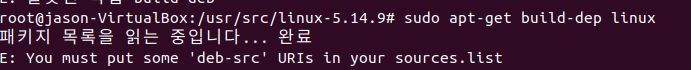

이런 에러가 뜬다면 "소프트웨어 업데이트" >> ubuntu Software >> source code를 체크해주자. 
    
    $ sudo apt-get install libncurses-dev flex bison openssl libssl-dev dkms libelf-dev libpci-dev libudev-dev libiberty-dev autoconf
 
 
 </br>  </br>
# 4. Kernel Configuration 파일을 만들자. 
	- 커널의 구성 요소에 대한 정보를 담당하는 파일이다. 이 파일은 .config이며, 이 파일을 만드는 방법은 세 가지가 있다. 이 중에 하나를 골라서 파일을 만들자. 
 </br></br>
 ## 4-1. default .config파일을 만들기
 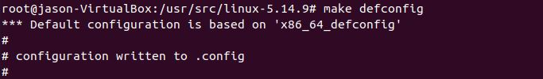
 
 	- 터미널에서 $ make defconfig를 통해 .config파일을 만든다. 
 	- 하지만 이 방법으로 만들면 마지막에 커널 컴파일에 에러가 날 수 도 있다. 필자는 그래서 다른 방법으로 만들었다. 
</br>  </br>
 ## 4-2. 원래 쓰던 커널의 config 복사하기
 	- 현재 사용 중인 커널의 config파일은 /boot 디렉토리에 존재한다. 
 	- $ cp /boot/config-사용중인 커널 버젼-generic ./.config 를 이용하여 복사해주자.
  </br>  </br>
  ### 팁 : 현재 커널 버젼 확인하는 명령어
   	$ uname -r
   </br>  </br>
 ## 4-3 새로운 config file을 만들기
	$ make menuconfig
    or $ make config
   
  ### 여기서 일어날 수 있는 문제
  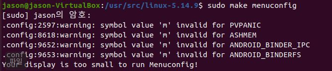
  
  이런 에러와 함께 column의 사이즈가 최소 80은 나와야 된다고 한다. 
  
  이 문제는 가상머신의 화면을 키워도 해결이 안 된다. 아니 그러면 column사이즈가 몇 이길래? 확인해보자. 
  
  	# 내 화면의 row col을 확인하는 방법
  	$ echo Columns=$COLUMNS Lines=$LINES
    
    # 아니면 이 방법으로 확인 가능
    $ sudo stty size
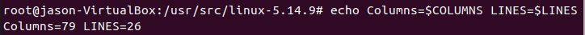

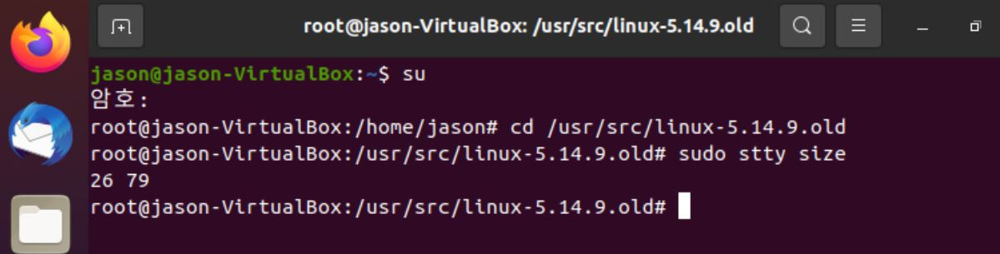  

 이런!!!! 이놈의 가상머신은 col의 기본 크기가 79이다. 치사하게 1 부족하게 만들어 놓은 것이다..... 하지만 우리는 사이즈를 바꿀 수 있는 명령어를 알고 있다. 
 
	 	
 	$ sudo stty rows 숫자 cols 숫자
   	# 여기서 cols 80을 하면 된다. 
    
 이후에 다시 make menuconfig 를 해보자. 

 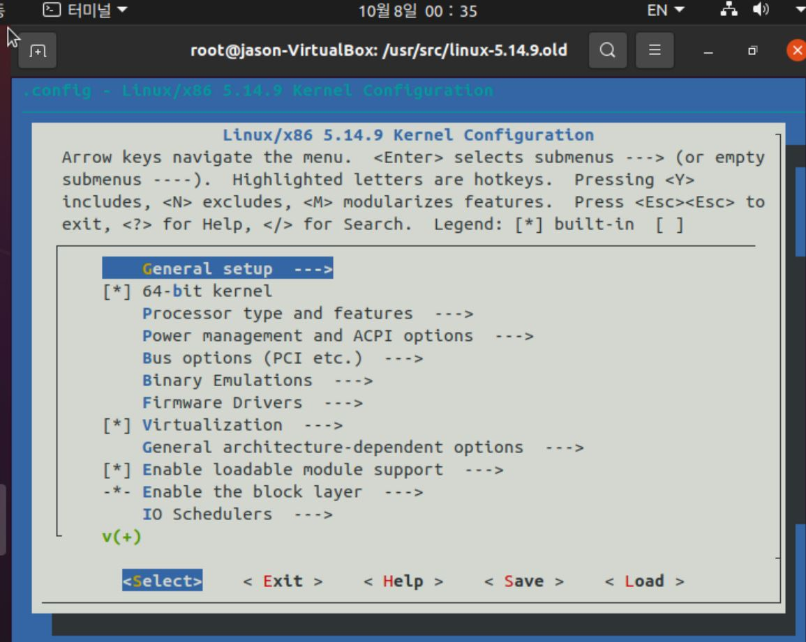
 
 아주 잘 됨을 알 수 있다. 여기서 save를 눌러주자. 
 </br>  </br>
# 5. 커널을 컴파일 해 주자.

다음 명령어를 순차적으로 입력 해 주자. 이 또한 시간이 좀 걸린다. 
좋아하는 노래를 들으며 멘탈을 잡자. 

	$ make
    $ make moudules_install
    $ make install
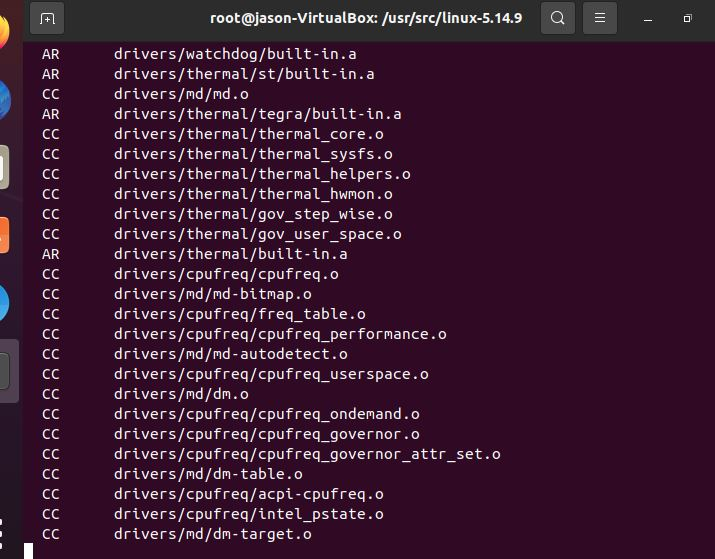

</br></br>

# 6. 리부트를 하기 전의 작업을 해 주자. 

    	$ vi /etc/default/grub
        # 위 명령어를 통해 파일을 열자. 
        
 그러면 다음과 같은 글이 있을 것이다. 
 
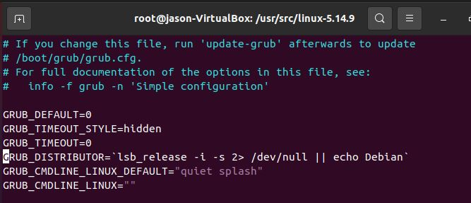

  
요 timeout style을 #로 주석처리를 해 주자. 
	
    GRUB_DEFAULT=0
    #GRUB_TIMEOUT_STYLE=hidden
    ...
    
그 뒤 가장 중요한 것 : 업데이트를 해줘야 된다. 
	
    $ sudo update-grub
이 명령어를 입력해야 바꾼 것이 완전히 적용이 된다. 

</br></br>

# 7. 리부트를 해 주자. 
	$ reboot
위 명령어를 입력하면 재부팅이 된다.  
</br>
#### 7-1. 재부팅시 다음과 같은 메뉴가 뜰 경우
	*ubuntu
    Advanced options for ubuntu
    Memory test (memtest86+)
    ...
그렇다면 Advanced options~를 클릭하여 컴파일 했던 최신 버젼을 누르면 그 버젼으로 실행이 된다. 
</br>
#### 7-2. 재부팅시 에러 : end kernel panic - Then try booting with the 'noapic' option. 을 만난 경우의 해결법
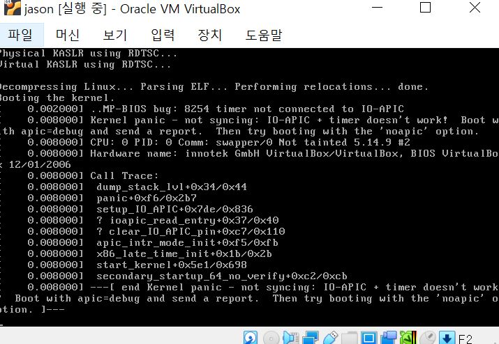

인터넷에 검색을 해 봐도 가상머신의 경우를 해결하는 방법은 없다. 
하지만 검색을 더 해본 결과, 다음과 같은 방법으로 이 문제를 해결하였다. 

	$ vi /etc/default/grub
       # 위 명령어를 통해 파일을 열자. 
그 후 아까와 마찬가지로  GRUB_어쩌구저쩌구가 있는 위치로 가자. 그곳에 다음과 같은 문장이 있을 것이다. 
	
    GRUB_DEFAULT=0
    #GRUB_TIMEOUT_STYLE=hidden
    ...
    GRUB_CMDLINE_LINUX_DEFUALT="quiet splash"
여기 마지막 줄 ""에 noapic을 입력해주자. 

	GRUB_DEFAULT=0
    #GRUB_TIMEOUT_STYLE=hidden
    ...
    GRUB_CMDLINE_LINUX_DEFUALT="quiet splash noapic"

그 뒤 똑같이 다음과 같은 명령어로 업데이트를 해 주자. 

	$ sudo update-grub
    
그리고 다시 재부팅을 해 주자. 그러면 될 것이다. 


</br></br>

# 8. 결과
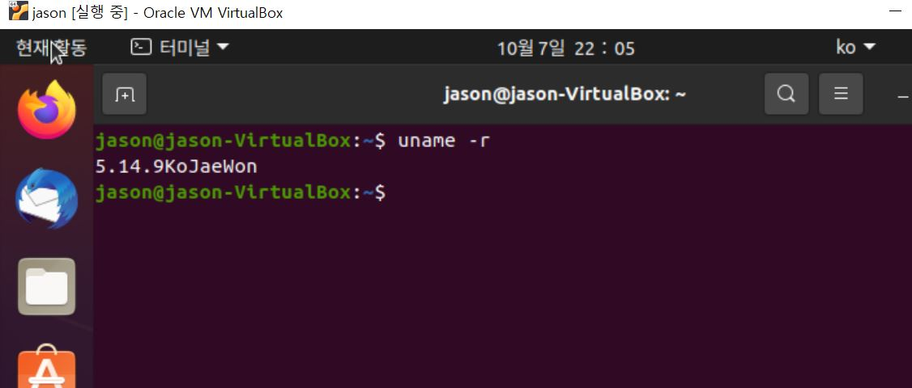

그림과 같이 최신 버젼인 5.14.9로 컴파일이 되었음을 알 수 있다. ( 뒤에 이름은 과제 때문에 넣은 것이다. )

</br></br>
# 9. 기타
Q: 다른 사이트에서 컴파일하는 방법을 따라가고 있는데, .deb파일이 안보여요
</br>
A: 만든 디렉토리 상위에 만들어져 있다. 즉 /usr/src/inux-5.14.9에서 만들었다면 /usr/src에 .deb파일이 만들어져 있다. 
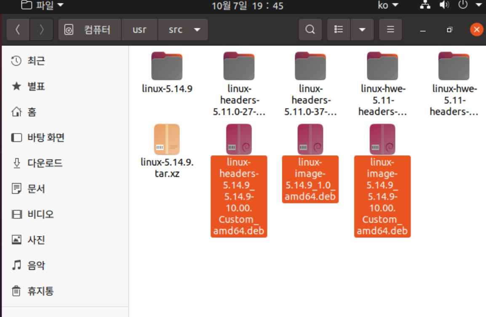


추후 기억나면 추가.
